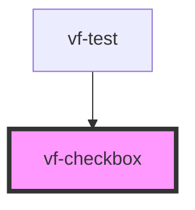

# vf-checkbox

<!-- Auto Generated Below -->

## Properties

| Property | Attribute | Description | Type               | Default     |
| -------- | --------- | ----------- | ------------------ | ----------- |
| `field`  | --        |             | `CheckboxProperty` | `undefined` |

## Events

| Event          | Description | Type                            |
| -------------- | ----------- | ------------------------------- |
| `eventChange`  |             | `CustomEvent<CheckboxProperty>` |
| `eventClick`   |             | `CustomEvent<CheckboxProperty>` |
| `eventInvalid` |             | `CustomEvent<CheckboxProperty>` |

## Dependencies

### Used by

 - [vf-test](../..)

### Graph

----------------------------------------------

*Built with [StencilJS](https://stenciljs.com/)*
