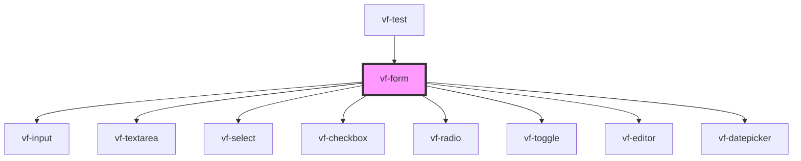

# vf-form

<!-- Auto Generated Below -->

## Properties

| Property     | Attribute     | Description | Type           | Default    |
| ------------ | ------------- | ----------- | -------------- | ---------- |
| `autoRender` | `auto-render` |             | `boolean`      | `false`    |
| `fields`     | --            |             | `FormProperty` | `{}`       |
| `reset`      | `reset`       |             | `any`          | `() => {}` |
| `submit`     | `submit`      |             | `any`          | `() => {}` |

## Dependencies

### Used by

 - [vf-test](../..)

### Depends on

- [vf-input](../input)
- [vf-textarea](../textarea)
- [vf-select](../select)
- [vf-checkbox](../checkbox)
- [vf-radio](../radio)
- [vf-toggle](../toggle)
- [vf-editor](../editor)
- [vf-datepicker](../datepicker)

### Graph

----------------------------------------------

*Built with [StencilJS](https://stenciljs.com/)*
