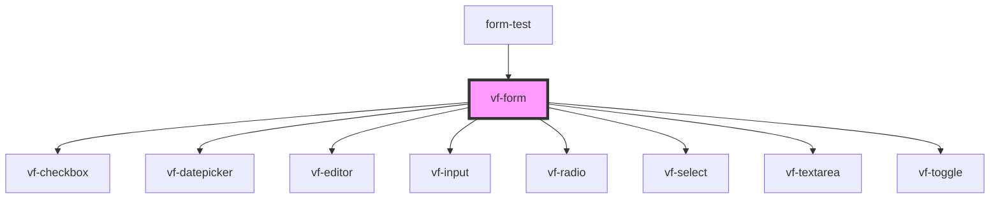

# vf-form

<!-- Auto Generated Below -->

## Properties

| Property | Attribute | Description | Type                          | Default     |
| -------- | --------- | ----------- | ----------------------------- | ----------- |
| `form`   | --        |             | `FormFields & FormController` | `undefined` |

## Events

| Event         | Description | Type                                       |
| ------------- | ----------- | ------------------------------------------ |
| `eventChange` |             | `CustomEvent<FormFields & FormController>` |

## Dependencies

### Used by

 - [form-test](../..)

### Depends on

- [vf-checkbox](../checkbox)
- [vf-datepicker](../datepicker)
- [vf-editor](../editor)
- [vf-input](../input)
- [vf-radio](../radio)
- [vf-select](../select)
- [vf-textarea](../textarea)
- [vf-toggle](../toggle)

### Graph

----------------------------------------------

*Built with [StencilJS](https://stenciljs.com/)*
