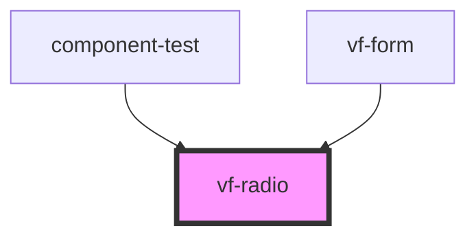

# vf-radio

<!-- Auto Generated Below -->

## Properties

| Property | Attribute | Description | Type            | Default     |
| -------- | --------- | ----------- | --------------- | ----------- |
| `field`  | --        |             | `RadioProperty` | `undefined` |

## Events

| Event          | Description | Type                         |
| -------------- | ----------- | ---------------------------- |
| `eventChange`  |             | `CustomEvent<RadioProperty>` |
| `eventClick`   |             | `CustomEvent<RadioProperty>` |
| `eventInvalid` |             | `CustomEvent<RadioProperty>` |
| `fieldChange`  |             | `CustomEvent<RadioProperty>` |

## Dependencies

### Used by

 - [component-test](../..)
 - [vf-form](../form)

### Graph

----------------------------------------------

*Built with [StencilJS](https://stenciljs.com/)*
