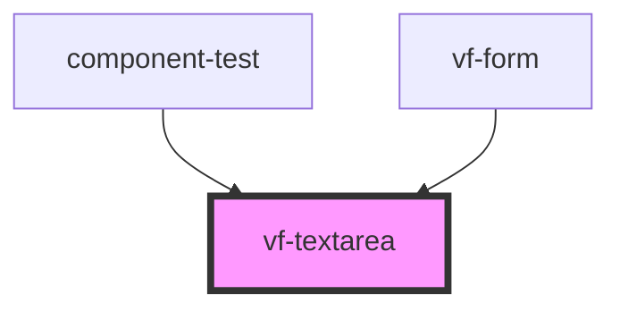

# vf-textarea

<!-- Auto Generated Below -->

## Properties

| Property | Attribute | Description | Type               | Default     |
| -------- | --------- | ----------- | ------------------ | ----------- |
| `field`  | --        |             | `TextareaProperty` | `undefined` |

## Events

| Event          | Description | Type                            |
| -------------- | ----------- | ------------------------------- |
| `eventBlur`    |             | `CustomEvent<TextareaProperty>` |
| `eventChange`  |             | `CustomEvent<TextareaProperty>` |
| `eventClick`   |             | `CustomEvent<TextareaProperty>` |
| `eventFocus`   |             | `CustomEvent<TextareaProperty>` |
| `eventInput`   |             | `CustomEvent<TextareaProperty>` |
| `eventInvalid` |             | `CustomEvent<TextareaProperty>` |

## Dependencies

### Used by

 - [component-test](../..)
 - [vf-form](../form)

### Graph

----------------------------------------------

*Built with [StencilJS](https://stenciljs.com/)*
