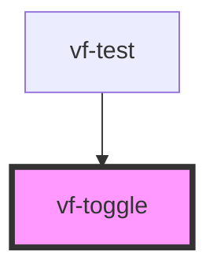

# vf-toggle

<!-- Auto Generated Below -->

## Properties

| Property | Attribute | Description | Type             | Default     |
| -------- | --------- | ----------- | ---------------- | ----------- |
| `field`  | --        |             | `ToggleProperty` | `undefined` |

## Events

| Event         | Description | Type                          |
| ------------- | ----------- | ----------------------------- |
| `eventChange` |             | `CustomEvent<ToggleProperty>` |

## Dependencies

### Used by

 - [vf-test](../..)

### Graph

----------------------------------------------

*Built with [StencilJS](https://stenciljs.com/)*
