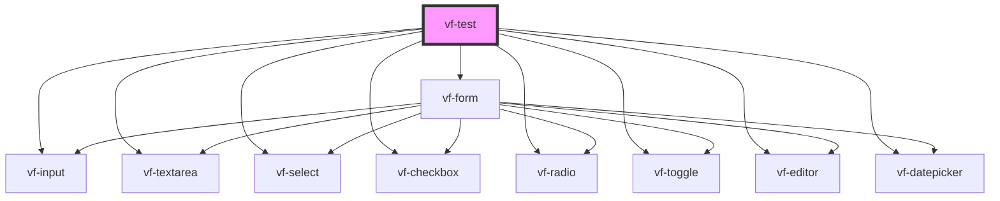

# vf-test

<!-- Auto Generated Below -->

## Properties

| Property     | Attribute | Description | Type               | Default                                                                                                                                                                                                                                                                                                                                                                                                                                                                                                                               |
| ------------ | --------- | ----------- | ------------------ | ------------------------------------------------------------------------------------------------------------------------------------------------------------------------------------------------------------------------------------------------------------------------------------------------------------------------------------------------------------------------------------------------------------------------------------------------------------------------------------------------------------------------------------- |
| `checkbox`   | --        |             | `CheckboxProperty` | `Formable.checkbox({     view: {       id: "checkbox",       label: "Checkbox",       required: true,     },   })`                                                                                                                                                                                                                                                                                                                                                                                                                    |
| `editor`     | --        |             | `EditorProperty`   | `Formable.editor({     view: {       id: "editor",       label: "editor",       required: true,     },   })`                                                                                                                                                                                                                                                                                                                                                                                                                          |
| `formFields` | --        |             | `FormProperty`     | `{     textarea: Formable.textarea({       view: {         id: "textarea",         label: "Textarea",         required: true,         rows: 3,       },     }),     datepicker: Formable.datepicker({       view: {         id: "datepicker",         label: "Datepicker",         required: true,         format: "DD/MM/YYYY",       },     }),   }`                                                                                                                                                                                |
| `input`      | --        |             | `InputProperty`    | `Formable.input({     view: {       id: "input",       label: "input",       type: "text",       required: true,     },     validators: [       {         match: /^(0{2}\/0{2}\/0{4})$/,         message: "must be 00/00/0000",       },     ],     lifecycle: {       componentWillLoad: async () => {         const response = await fetch(           "https://jsonplaceholder.typicode.com/todos/1"         );         const data = await response.json();          this.input = this.input.set(data.title);       },     },   })` |
| `radio`      | --        |             | `RadioProperty`    | `Formable.radio({     view: {       id: "radio",       label: "Radio",       required: true,       options: [         { value: "m", label: "Male" },         { value: "f", label: "Female" },         { value: "other", label: "Other" },       ],     },     value: "m",   })`                                                                                                                                                                                                                                                       |
| `select`     | --        |             | `SelectProperty`   | `Formable.select({     view: {       id: "select",       label: "select",       required: true,       options: [         { value: 1, label: "One" },         { value: 2, label: "Two" },       ],     },   })`                                                                                                                                                                                                                                                                                                                        |
| `toggle`     | --        |             | `ToggleProperty`   | `Formable.toggle({     view: {       id: "toggle",       label: "Toggle",       required: true,     },     value: true,   })`                                                                                                                                                                                                                                                                                                                                                                                                         |

## Events

| Event        | Description | Type               |
| ------------ | ----------- | ------------------ |
| `formSubmit` |             | `CustomEvent<any>` |

## Dependencies

### Depends on

- [vf-form](./components/form)
- [vf-input](./components/input)
- [vf-select](./components/select)
- [vf-checkbox](./components/checkbox)
- [vf-radio](./components/radio)
- [vf-editor](./components/editor)
- [vf-toggle](./components/toggle)
- [vf-textarea](./components/textarea)
- [vf-datepicker](./components/datepicker)

### Graph

----------------------------------------------

*Built with [StencilJS](https://stenciljs.com/)*
